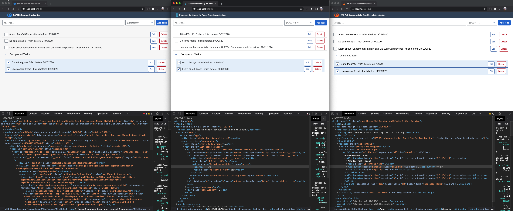
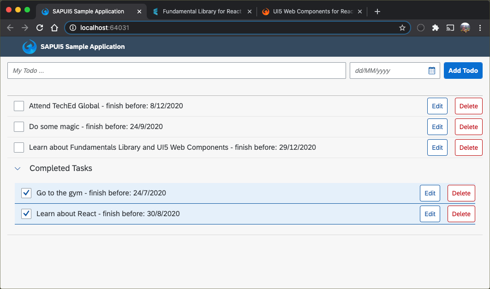
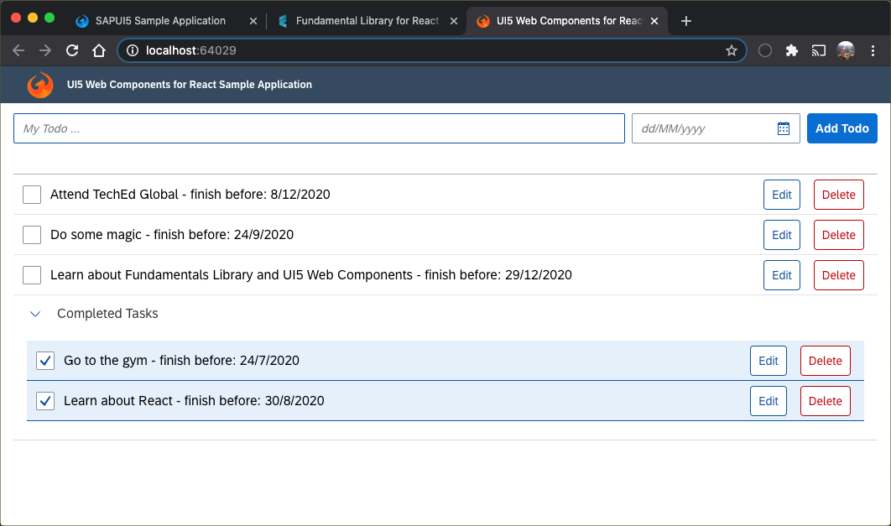

# Important Notice
This public repository is read-only and no longer maintained. For the latest sample code repositories, visit the [SAP Samples](https://github.com/SAP-samples) organization.

# Comparison of Multiple Web Technologies by SAP

[](https://api.reuse.software/info/github.com/SAP-samples/web-technologies-comparison)

This repository serves the purpose of understanding the fundamental differences of various web technologies from SAP. To illustrate these differences, we built three (almost identical) To-Do list sample applications with the following technologies:
- [SAPUI5](https://sapui5.hana.ondemand.com/) / [OpenUI5](https://openui5.hana.ondemand.com/) 
- [UI5 Web Components for React](https://sap.github.io/ui5-webcomponents-react/)
- [Fundamental React](https://sap.github.io/fundamental-react/)

There is also a [TechEd Online 2020](http://www.sapteched.com/), which highlights the differences and similarities of these technologies. You can find the [full session IIS114](https://events.sapteched.com/widget/sap/sapteched2020/Catalog?search=iis114) and all other videos on the SAP Teched website. 



The screenshot shows the rendered web apps. All of them are Fiori 3-compliant to look almost identical. In the DOM tree, you can see that the various technologies' rendering behavior is very different.


# Requirements

- Install Node.js (version 12 or 14) from <https://nodejs.org/en/download/>.
- Optional: Install [yarn](https://yarnpkg.com/getting-started/install)

# Download and Installation

First, you need to clone the project. 
```
git clone https://github.com/SAP-samples/web-technologies-comparison
cd web-technologies-comparison
yarn install #alternative: npm install
```

> Feel free to fork and star it as well.

## Build and run all three web apps

1. Build and run all three web apps.
    ```
    yarn build #alternative: npm run build
    yarn serve #alternative: npm run serve
    ```
2. Open the web apps from the printed links.

    


## Run a single web app in development mode

1. Pick the web app you want to run in development mode.
    ```
    cd sapui5-sample-app/
    # or: cd fundamentals-lib-react-sample-app/
    # or: cd ui5-webcomponents-for-react-sample-app/
    ```
2. Run the start script.
    ```
    yarn start #alternative: npm start
    ```
3. Test the web app (a new browser tab should open automatically and display the web app).


# The Technologies

## SAPUI5 Sample App
SAPUI5 and its [open-sourced](https://github.com/SAP/openui5) sibling, OpenUI5, are probably the best knows web technologies in this comparison. Both are commonly referred to as “UI5” and let you build enterprise-ready web applications responsive to all devices, running on almost any browser of your choice. They are based on JavaScript, using jQuery as their foundation, and follow web standards. They ease your development with a client-side HTML5 rendering library, including a rich set of controls, and support data binding to different data models (JSON, XML, and OData).


## UI5 Web Components for React Sample App
This sample app leverages the [UI5 Web Components](https://sap.github.io/ui5-webcomponents/), which provide a set of [web components](https://www.webcomponents.org/) that share many methods and properties with well-known SAPUI5 controls. These will help SAPUI5 developers to find their way when getting started with this new technology. UI5 Web Components are neither built on top of UI5, but rather light-weight and independent UI elements nor are they a successor of UI5, but rather a complementary offering. These web components can be used natively or in combination with any web development framework such as [Angular](https://angular.io/), [React](https://reactjs.org/), and [Vue.js](https://vuejs.org/). 

For React, there is even a separate wrapper implementation around UI5 Web Components, making them even more comfortable. This sample application has been implemented with the [UI5 Web Components for React](https://github.com/SAP/ui5-webcomponents-react).




## Fundamental React Sample App
The sample application leverages the [Fundamental Library Styles](https://sap.github.io/fundamental/), which delivers a Fiori 3 component library for building SAP user interfaces with any web technology. Fundamental Library Styles is a light-weight presentation layer that can be used with your UI framework of choice (e.g., [Angular](https://angular.io/), [React](https://reactjs.org/),  [Vue.js](https://vuejs.org/), etc.). With Fundamental Library Styles, a library of stylesheets and HTML tags, developers can build consistent Fiori apps in any web-based technology.

This sample application has been implemented with the [Fundamental React](https://github.com/SAP/fundamental-react), which offers a React implementation of the components designed in Fundamental Styles.

> Besides Fundamental React, there also exists [Fundamental Angular](https://github.com/SAP/fundamental-ngx) and [Fundamental Vue](https://github.com/SAP/fundamental-vue).


## Comparision 

The following table shows a comparison between the mentioned web technologies. For a further explanation, please check out [this blog post](https://blogs.sap.com/2020/12/02/beyond-sapui5-and-sap-fiori-elements-appendix-to-teched-session-iis114/) or the associated  [TechEd Online session IIS114](https://events.sapteched.com/widget/sap/sapteched2020/Catalog?search=iis114).

|                                        | Fundamental Library Styles | UI5 Web Components | SAPUI5/OpenUI5   |
| -------------------------------------- | -------------------------- | ------------------ | -------- |
| Runtime size of sample app¹             | ≈1.6MB                     | ≈0.9MB             | ≈7.6MB   |
| Performance of sample app²              | 99                         | 100                 | 67       |
| Flexibility                            | Very high                  | High               | Moderate |
| Open standards                         | High                       | Very high          | Moderate |
| Available controls                     | 100+                       | 80+                | 650+     |
| Vendors                                | \>2                        | \>2                | 1        |
| Compatibility with SAP Fiori launchpad | Decoupled `<iframe>`               | Decoupled `<iframe>`       | Integrated `<iframe>`     |
| Maturity                               | v0.13.0             | v0.27.0       | v1.84.1  |
| Themeable                              | ✅                          | ✅                  | ✅        |
| SAP Fiori compliant                    | ✅                          | ✅                  | ✅        |

> As of December 2020
>
> ¹ Measured with the [network inspector](https://developers.google.com/web/tools/chrome-devtools/network) of the Google Chrome Dev Tools
>
> ² According to the Google Chrome [Lighthouse report](https://developers.google.com/web/tools/lighthouse)

# Limitations
The project contains standalone web apps. Deployment configuration files for any platform, such as SAP Cloud Platform, are not in the scope of this repository.

# Known Issues
None so far :)

# How to obtain support
This content is provided "as-is" with no other support.

# License
Copyright (c) 2020 SAP SE or an SAP affiliate company. All rights reserved. This project is licensed under the Apache Software License, version 2.0 except as noted otherwise in the [LICENSE](LICENSES/Apache-2.0.txt) file.
                                                      
